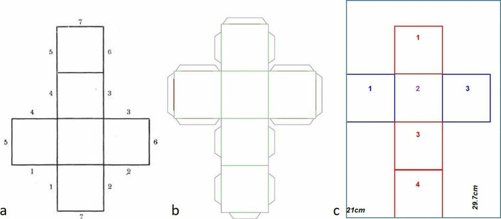
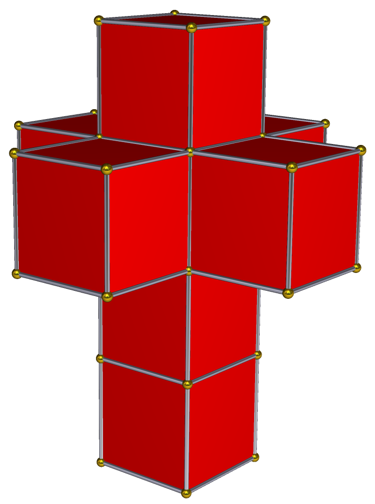
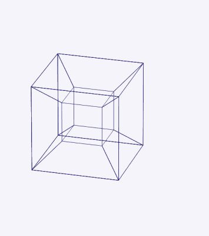

<h1 style="text-align:center;">Unfolding an n-dimensional hypercube?</h1>

Making 2D origami of nD cubes for nD beings so they can have fun as well.

Origami is cool. It's the Japanese art of paper folding, a craft that transforms flat paper into intricate shapes.

I want to unorigami a higher dimensional cube or an n-dimensional hypercube. We'll be, "unfolding" it.

# What does it mean to unfold an n-dimensional hypercube?
Just like we can create a cube from folding 6 squares

and create a tesseract (4D cube) from folding 8 cubes

We can do the opposite and break down or unfold a tesseract into 8 cubes or more interestingly into **24 squares**. The reason it breaks into 24 squares instead of 48 (8 cubes * 6 squares) is that the 8 cubes have connected edges.

### Generalization:
- n-dimensional hypercube: In general, an n-dimensional hypercube has 2^n vertices and n * 2^(n-1) edges.
- Vertices: The number of vertices in an n-dimensional hypercube is always 2^n.
- Edges: The number of edges is obtained by multiplying the dimension (n) by the number of vertices in the (n-1)-dimensional hypercube (2^(n-1)).

### Elaboration:
- 2-dimensional cube (square): A square has 4 vertices and 4 edges.
- 3-dimensional cube: A cube (3-dimensional hypercube) has 8 vertices and 12 edges.
- 4-dimensional cube (tesseract): A tesseract has 16 vertices and 32 edges. 

### Run the application
1. Run the following command in the console `python -m venv .venv`
1. Run the following command in the console `.\.venv\Scripts\activate`
1. Run the following command in the console `python .\main.py`